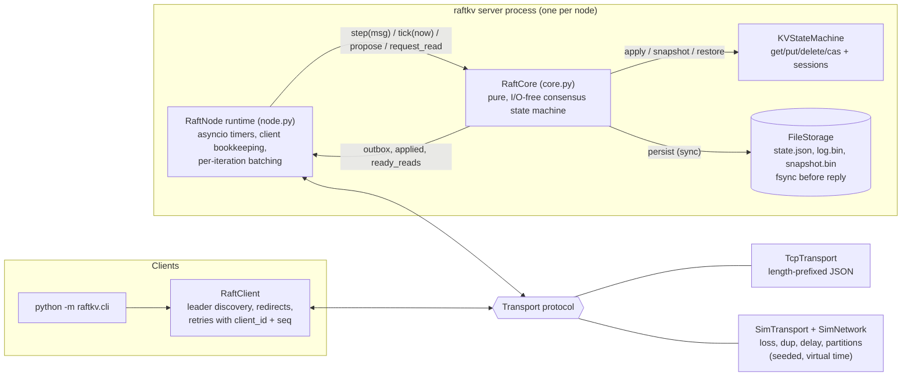

# raftkv

A fault-tolerant, linearizable key-value store built on the Raft consensus algorithm, written in Python 3.11+ asyncio with no runtime dependencies.

raftkv implements the Raft paper (Ongaro & Ousterhout, 2014): leader election, log replication, persistence, and log compaction. It adds exactly-once client sessions and linearizable reads through ReadIndex. The emphasis is on verification. A deterministic simulator runs the unmodified runtime over a network that drops, duplicates, reorders, and partitions messages, while nodes crash and restart. Raft's safety invariants are checked throughout each run, and a Wing & Gong / Knossos-style checker verifies that every recorded client history is linearizable.

```
$ python scripts/demo_cluster.py
==> SIGKILL leader (node 1)
    new leader: node 2, observed 203 ms after the kill
==> reading through the new leader; writing more
    city2 = Nairobi
==> restarting node 1 from its data directory
    node 1 rejoined as a follower and caught up.
```

## Contents

- [Architecture](#architecture)
- [How Raft is implemented](#how-raft-is-implemented)
- [Testing](#testing)
- [Running a cluster](#running-a-cluster)
- [Performance](#performance)
- [Limitations and future work](#limitations-and-future-work)

## Architecture



The code is split into layers:

| Layer | File | Responsibility |
|---|---|---|
| Consensus | `raftkv/core.py` | Raft as a deterministic state machine. It takes `step(src, msg, now)` and `tick(now)` and fills an outbox. It has no sockets, clocks, or tasks (the etcd/raft design). |
| Runtime | `raftkv/node.py` | Drives one core from an asyncio loop: schedules the next deadline, sends the outbox, maps applied log indices back to waiting clients. |
| Durability | `raftkv/storage.py` | `FileStorage` (fsync'd, CRC-framed, crash-recovering) and `MemoryStorage` (used by the simulator as a disk that survives crashes). |
| State machine | `raftkv/statemachine.py` | KV operations and the exactly-once session table. |
| Transport | `raftkv/transport.py`, `raftkv/sim/network.py` | One `Transport` protocol with two implementations: real TCP and the fault-injecting simulator. |
| Client | `raftkv/client.py` | Leader discovery, redirects, timeouts, retries. |
| Verification | `raftkv/sim/*`, `raftkv/linearizability.py` | Virtual-time event loop, nemesis, invariant checker, linearizability checker. |

## How Raft is implemented

All section numbers refer to the extended Raft paper.

**Elections (section 5.2).** Each node picks a randomized election timeout from `[150, 300]` ms. A candidate increments its term, votes for itself, persists both, and requests votes. A voter grants at most one vote per term, persists `votedFor` before it replies, and only votes for a candidate whose log is at least as up to date as its own (last term first, then length; section 5.4.1). Any message with a higher term makes the receiver step down. A two-leaders-in-one-term situation is an assertion failure in the core.

**Replication (section 5.3).** The leader keeps `nextIndex`/`matchIndex` per follower. A follower runs the `prevLogIndex/prevLogTerm` consistency check and truncates its log only at a real conflict. It never truncates because a message is shorter than its log, since such a message may simply be a delayed or reordered one. A rejection carries fast-backtracking hints (`conflictTerm` plus the first index of that term, or the follower's log length). The leader uses them to skip a whole term per round trip. A test repairs a 40-entry divergent suffix with at most 2 rejections.

**Commitment (section 5.4.2).** The leader commits index `N` only when a quorum has `matchIndex >= N` **and** `log[N].term == currentTerm`. Entries from earlier terms commit indirectly. `tests/test_core_replication.py` replays all three branches of **Figure 8** message by message:

- (c) A term-2 entry sits on 3 of 5 nodes and is still not committed.
- (d) That entry is then safely overwritten.
- (e) Replicating a current-term entry commits both entries and makes the old leader unelectable.

A new leader appends a no-op entry so that it learns the commit index promptly (section 8).

**Persistence.** `currentTerm`, `votedFor`, the log, and the snapshot go through `Storage` synchronously, *before* the core puts any dependent message in its outbox. `FileStorage` uses:

- `state.json`, replaced atomically (write a temp file, fsync, rename, fsync the directory).
- `log.bin`, an append-only file of `[len][crc32][json]` records. A torn tail from a crash fails its CRC and is truncated on load.
- `snapshot.bin`, replaced atomically.

Recovery also handles a crash between writing a snapshot and rewriting the log.

**Snapshots (section 7).** Once `snapshot_threshold` applied entries have accumulated, the node snapshots its state machine (KV data plus the session table) and compacts the log. The log keeps the boundary `(index, term)` so the consistency check still works there. If a follower needs entries that were compacted away, the leader sends `InstallSnapshot`. The follower keeps any log suffix that extends the snapshot and discards it otherwise.

**Exactly-once writes (dissertation section 6.3).** Each client has a `client_id` and numbers its writes with `seq`. A retry reuses the same `seq`. The state machine remembers the last `seq` and result per client, so a duplicate returns the cached result instead of executing again. This matters when a write commits but its reply is lost. One test runs 60 back-to-back CAS increments over a network that drops 20% and duplicates 30% of messages. Each CAS must report success: without sessions, a retried CAS would re-execute and return `swapped=False`.

**Linearizable reads with ReadIndex (dissertation section 6.4).** Reads do not go through the log. The leader:

1. Waits until it has committed an entry in its current term (its no-op).
2. Records `readIndex = commitIndex`.
3. Bumps a heartbeat sequence number and broadcasts. The read is confirmed once a quorum has acknowledged a sequence number at least as new. Those acks prove no newer leader existed when the read arrived.
4. Serves the read from local state, which has been applied at least to `readIndex`.

A partitioned ex-leader therefore never answers a read. `test_partitioned_leader_never_serves_read` and a mutation test (below) check this. I chose ReadIndex over leader leases because its safety does not depend on bounded clock drift.

## Testing

```
pytest          # 311 tests, about 15 s on an Apple Silicon laptop
pytest -m slow  # +2,000 fault-injection seeds of 30 simulated seconds (about 4 min)
```

| Suite | What it covers |
|---|---|
| `test_core_election.py` | Single vote per term, durable votes across restart, the up-to-date check, step-down on higher term, split votes, minority partitions. |
| `test_core_replication.py` | Consistency check and conflict hints, fast backtracking, truncation of uncommitted suffixes only, stale/reordered `AppendEntries`, the commit bound on followers, leader group commit, **Figure 8 (c)/(d)/(e)**, convergence under random loss, duplication, and reordering. |
| `test_core_snapshot_and_reads.py` | Compaction, `InstallSnapshot` to a lagging follower, restart from snapshot plus log, suffix retention, ReadIndex quorum confirmation, deferral until the no-op commits, the deposed-leader stale-read scenario. |
| `test_storage.py` | Torn writes, bit rot, interrupted snapshot rewrite, and a hypothesis state-machine test checking `FileStorage` (including random reopens) against an in-memory model. |
| `test_cluster_sim.py` | End to end with real `RaftNode`s and `RaftClient`: redirects, leader crash and rejoin, full-cluster restart, exactly-once CAS on a lossy network, minority partitions, snapshot catch-up, real-disk crash/restart. |
| `test_tcp.py`, `test_cli.py` | The same over real sockets, plus three `python -m raftkv.server` processes driven by `python -m raftkv.cli`. |
| `test_linearizability.py` | The checker against hand-written histories, generated linearizable histories, corrupted histories, and a **brute-force oracle** (1,500 random small histories must get identical verdicts). |
| `test_fault_injection.py` | 183 randomized fault scenarios (see below). |
| `test_bug_detection.py` | Mutation tests for the harness itself (see below). |

### Deterministic simulation

`raftkv.sim.VirtualTimeLoop` is a standard `asyncio.SelectorEventLoop` whose clock jumps forward whenever the loop would otherwise sleep. The production runtime, client library, `asyncio.sleep`, and `wait_for` timeouts all run unmodified. Two things follow:

- A 15-second simulated scenario with 5 nodes and 5 clients takes about 50 ms of wall time.
- With all randomness drawn from seeded RNGs, a run is fully reproducible from its seed. `test_runs_are_deterministic` asserts this.

### Fault model

Each scenario in `raftkv.sim.workload` runs a 3- or 5-node cluster for 15 simulated seconds:

- **Network:** 5% message loss, 5% duplication, and a uniform 1–30 ms delay per message, which reorders messages freely. The "hostile" variant uses 25% loss, 25% duplication, and up to 80 ms of delay. Messages pass through the real JSON codec. A partition also destroys messages already in flight.
- **Nemesis:** every 0.3–1.2 s it picks one of:
  - a random partition
  - isolating the current leader
  - a "bridge" topology (two halves connected only through one node)
  - healing
  - crashing a random node or the leader (keeping at most a minority down)
  - restarting a crashed node

  A crash discards all volatile state; the node restarts from storage. Three seeds run on real `FileStorage` on disk.
- **Clients:** 4–5 concurrent clients issue random `get`/`put`/`delete`/`cas` operations on 2–3 keys with unique values. Every invocation and response is recorded with its virtual timestamp. An operation whose client gave up has an unknown outcome, and the checker may place it anywhere after its invocation, or effectively never.

A run passes only if all of the following hold:

1. **Election safety, leader completeness, state machine safety, and log matching** (Figure 3) hold at every step. The first three are checked at the moment of each election and each apply. Log matching is checked across all pairs of live nodes every 100 ms of simulated time.
2. The full client history is **linearizable**.
3. After faults stop, the cluster elects a leader and completes a new write (**liveness**).
4. All replicas **converge** to identical state.
5. At least 40 operations completed, so a stalled cluster cannot pass vacuously.

### Linearizability checker

`raftkv/linearizability.py` implements the Wing & Gong backtracking search with Lowe's memoization of `(linearized-set, model-state)` pairs, the approach used by Knossos and Porcupine. Linearizability is local (Herlihy & Wing), so each key is checked independently, which avoids an exponential blow-up. The model is a register supporting `get`, `put` (which returns the previous value, giving the checker more to verify), `delete`, and `cas`. A 2,500-operation history with 8 overlapping clients checks in about 10 ms.

### Testing the tests

A fault-injection suite that never fails proves little. `test_bug_detection.py` monkeypatches six classic Raft bugs into the implementation and requires the harness to catch each one within a bounded number of seeds:

| Injected bug | Caught by |
|---|---|
| Leader serves reads from local state without ReadIndex | Linearizability checker (stale read from a partitioned ex-leader) |
| `votedFor`/`currentTerm` not persisted | A restarted node rejoins an old term; the cluster fails to converge |
| No log up-to-date check in `RequestVote` | Leader completeness invariant |
| No session dedup | Linearizability checker (a retried write applied twice) |
| Committing old-term entries by counting replicas | Figure 8 unit test |
| Follower truncates on every `AppendEntries` | Replicas fail to converge after an acknowledged entry is lost |

## Running a cluster

```bash
python3 -m venv .venv && source .venv/bin/activate
pip install -e ".[dev]"

# Option A: a 3- or 5-node cluster in one command (one process per node)
python -m raftkv.local_cluster --nodes 3          # Ctrl-C to stop

# Option B: start each node yourself
PEERS=1=127.0.0.1:7001,2=127.0.0.1:7002,3=127.0.0.1:7003
python -m raftkv.server --id 1 --peers $PEERS --data-dir data/1
python -m raftkv.server --id 2 --peers $PEERS --data-dir data/2
python -m raftkv.server --id 3 --peers $PEERS --data-dir data/3
```

`--peers` lists the full, static membership, including the node itself. Then connect a client:

```text
$ python -m raftkv.cli
raftkv> put greeting hello
OK (previous: (nil))
raftkv> cas greeting hello hi
swapped; current = hi
raftkv> status
  id       role  term leader  commit applied   snap
   1     leader     1      1       3       3      0
   2   follower     1      1       3       3      0
   3   follower     1      1       3       3      0
```

You can also run one command at a time with `python -m raftkv.cli get greeting`. `python scripts/demo_cluster.py` runs the failover walkthrough shown at the top of this page.

Use it as a library:

```python
from raftkv.client import connect

client = connect("1=127.0.0.1:7001,2=127.0.0.1:7002,3=127.0.0.1:7003")
await client.put("k", "v")
assert await client.get("k") == "v"
swapped, current = await client.cas("k", expected="v", value="w")
```

## Performance

`scripts/benchmark.py` starts three server processes on localhost (each fsyncs every log write) and runs N closed-loop clients, each with its own TCP connection, for 5 seconds per row. Values are 64 bytes.

Measured on an Apple Silicon Mac (arm64, macOS 26.4, Python 3.14), single run:

**Default (`fsync`):**

| operation | clients | ops/s | p50 ms | p99 ms |
|---|---:|---:|---:|---:|
| put (write) | 1 | 3,586 | 0.27 | 0.35 |
| put (write) | 8 | 11,063 | 0.71 | 0.98 |
| put (write) | 32 | 21,397 | 1.46 | 2.02 |
| get (ReadIndex read) | 1 | 4,102 | 0.24 | 0.27 |
| get (ReadIndex read) | 8 | 21,525 | 0.37 | 0.47 |
| get (ReadIndex read) | 32 | 44,756 | 0.71 | 0.89 |

**With `--full-fsync` (`F_FULLFSYNC`, survives power loss):**

| operation | clients | ops/s | p50 ms | p99 ms |
|---|---:|---:|---:|---:|
| put (write) | 1 | 90 | 11.05 | 13.02 |
| put (write) | 8 | 154 | 50.86 | 73.14 |
| put (write) | 32 | 467 | 69.20 | 103.41 |
| get (ReadIndex read) | 1 | 4,074 | 0.24 | 0.29 |
| get (ReadIndex read) | 8 | 18,440 | 0.43 | 0.66 |
| get (ReadIndex read) | 32 | 41,185 | 0.77 | 1.15 |

Reproduce with `python scripts/benchmark.py` (add `--full-fsync` for the second table). A repeat of the default run came within about 10% of these numbers.

Notes:

- On macOS, plain `fsync()` does not flush the drive's write cache, so the first table reflects a weaker durability guarantee. Each write needs two `F_FULLFSYNC` calls in sequence (leader, then follower), and they account for most of the 11 ms single-client write latency in the second table. Reads never touch the disk.
- The leader uses group commit. Proposals that arrive in the same event-loop iteration are appended with one fsync and sent in one `AppendEntries` round, and the leader counts itself toward the quorum only once its copy is durable (`test_burst_of_proposals_is_group_committed`, `test_leader_does_not_count_its_unpersisted_entries`). Followers still fsync once per `AppendEntries`, and each follower has at most one batch in flight. Those two limits are why durable-write throughput scales poorly in the second table.
- Every node is a single Python process on one core. These numbers describe this implementation on one laptop over loopback. They are not a statement about Raft in general.

## Limitations and future work

These are deliberate scope cuts:

- **Static membership.** Joint consensus or single-server membership changes (section 6) are not implemented, and the cluster size is fixed at startup.
- **No PreVote or CheckQuorum.** A node rejoining after a partition with an inflated term forces a needless election. This affects availability, not safety. The simulator exercises the behavior constantly.
- **Snapshots are monolithic.** `InstallSnapshot` sends the whole snapshot in one message rather than in chunks, and snapshots are taken synchronously on the event loop. That is fine for small datasets but not for large ones.
- **Sessions never expire.** The session table grows by one entry per client ever seen. A real deployment needs expiry that is deterministic and replicated through the log (dissertation section 6.3).
- **One outstanding request per client**, which the session protocol requires. A client library could pipeline requests with per-request sequence numbers.
- **Synchronous disk I/O on the event loop.** Followers fsync each `AppendEntries` separately, and each follower has at most one batch in flight (no pipelining). There is no TLS or authentication.
- **The simulator covers network and crash faults, not disk faults.** It does not model lost fsyncs or corrupted reads inside a run. Torn writes and corruption are tested separately in `test_storage.py`.

Possible next steps: pipelined replication and follower-side group commit, PreVote and CheckQuorum, leadership transfer, membership changes, chunked and streaming snapshots, lease-based reads as an opt-in fast path with documented clock assumptions, and sharding over multiple Raft groups.

## References

- D. Ongaro and J. Ousterhout. *In Search of an Understandable Consensus Algorithm (Extended Version).* 2014.
- D. Ongaro. *Consensus: Bridging Theory and Practice.* PhD dissertation, Stanford, 2014 (sessions, ReadIndex).
- J. Wing and C. Gong. *Testing and Verifying Concurrent Objects.* JPDC, 1993.
- G. Lowe. *Testing for Linearizability.* Concurrency and Computation, 2017.
- M. Herlihy and J. Wing. *Linearizability: A Correctness Condition for Concurrent Objects.* TOPLAS, 1990.

## License

MIT. See [LICENSE](LICENSE).
